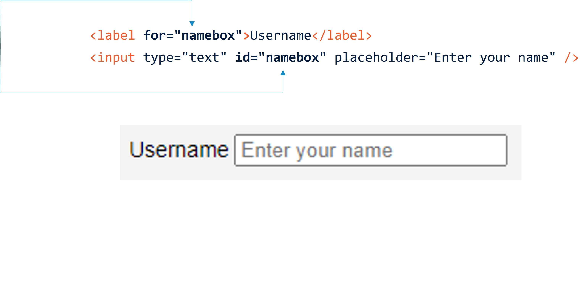
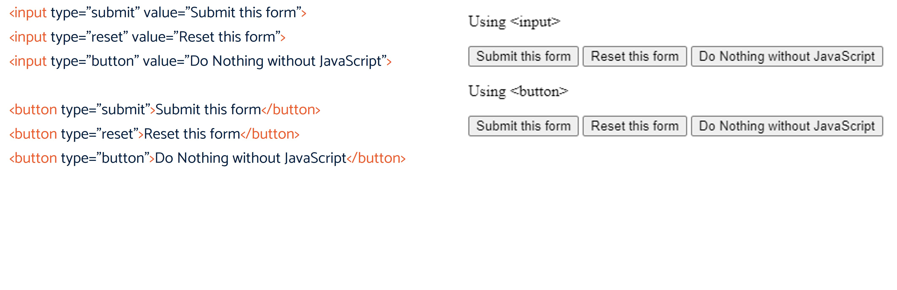
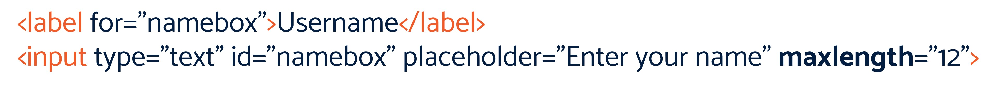
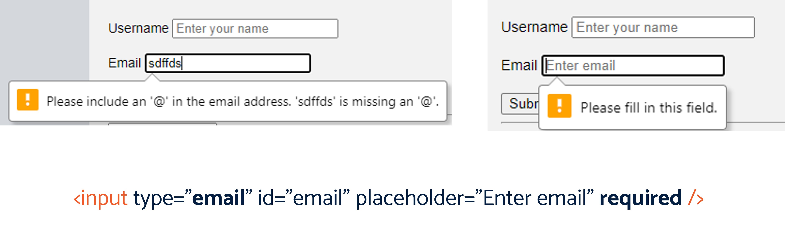

# HTML

If you have always wanted to make your own Web page, but you were under the impression that it would be very difficult, then there should really be no problem. To create your own Web page, all you need to have is a thorough understanding of HTML. And HTML is not all that difficult to learn. 

<!-- TOC -->

- [HTML](#html)
    - [What is HTML](#what-is-html)
    - [Getting Started](#getting-started)
    - [My first HTML page](#my-first-html-page)
    - [HTML Page Structure](#html-page-structure)
    - [Tags vs Elements](#tags-vs-elements)
        - [Element Syntax](#element-syntax)
        - [Nested Elements](#nested-elements)
    - [Some Common Tags](#some-common-tags)
    - [Let's Play Around With Tags](#lets-play-around-with-tags)
    - [Title](#title)
    - [Lists](#lists)
    - [Attributes](#attributes)
    - [Images](#images)
    - [What’s a URL](#whats-a-url)
    - [Alt, Width & Height](#alt-width--height)
        - [Let’s add a picture to our page](#lets-add-a-picture-to-our-page)
    - [Links](#links)
        - [Let’s add a link!](#lets-add-a-link)
        - [Making an image a link?](#making-an-image-a-link)
    - [Tables](#tables)
        - [When not to use tables](#when-not-to-use-tables)
        - [Creating Tables](#creating-tables)
        - [Multiple columns](#multiple-columns)
        - [Table Headers](#table-headers)
        - [Spanning Columns](#spanning-columns)
        - [Spanning Rows](#spanning-rows)
        - [Tables Are Flexible](#tables-are-flexible)
- [Forms & Fields](#forms--fields)
    - [The \<form> tag](#the-\form-tag)
    - [Input Fields](#input-fields)
    - [Checkboxes](#checkboxes)
    - [Radio Buttons](#radio-buttons)
    - [Drop Down Menus](#drop-down-menus)
    - [Text Area](#text-area)
    - [Submit](#submit)
    - [The id element](#the-id-element)
- [Doctype & Layout](#doctype--layout)
    - [Understanding the doctype](#understanding-the-doctype)
    - [Website Layout](#website-layout)
        - [Div Based Layout](#div-based-layout)
- [HTML 5](#html-5)
    - [Structural Tags](#structural-tags)
    - [Form Features](#form-features)
        - [Placeholder](#placeholder)
        - [Buttons](#buttons)
        - [Form Validation](#form-validation)
        - [Required Attribute](#required-attribute)
    - [Workshop 1](#workshop-1)

<!-- /TOC -->


## What is HTML


HTML is the brainchild of Tim Berners-­Lee. In 1990, Berners­-Lee needed something that would help scientists coming from different colleges and universities access documents and research from other scientists. That problem led to Berners­-Lee inventing the World Wide Web, the hypertext transfer protocol or HTTP, and HTML.

---

HTML is actually shorthand for Hypertext Markup Language. It is the language of Web pages that tells a browser how to display certain elements, such as text and images through the use of codes and symbols. HTML is the standard when it comes to creating Web pages. The World Wide Web Consortium, or W3C recommends it. Being such, most browsers implement HTML to help display Web pages more or less uniformly.

## Getting Started

You can start with using Notepad, a text editor that is included in your Windows installation. If you are not using Windows, or if you prefer other text editors, there is a lot of free software that you can download from the Internet. 

Or you could get one of those HTML or WYSIWYG editors. WYSIWYG stands for "what you see is what you get." Think of it as a layout tool that allows you to easily create an HTML page and format it without bothering too much about tags and elements. 

So we do recommend hard­coding if you are still learning. Hard­coding means to write HTML using a text editor. 
There are two things that you need to know to get started with HTML: 
1. The basic tags and elements. 
2. The structure of an HTML page


## My first HTML page

Create a *new* file in your Documents folder named `index.html`

Right-click and select `Open With…Notepad`

Enter the following text:

> Hello, my name is \<strong>HAL 9000\</strong>

Save the file (Ctrl+S normally) and the double-click on it to open in your default browser.

## HTML Page Structure


HTML is very simple and it is logical. A browser would start reading an HTML page from the top going down, from left going right. It does follow a basic structure. First, you have to declare that the document is an HTML document. You can do this by using the tag. Then there are the two other sections called the and of your document. The head is where you put in all the information you want to include about your document. The body is basically the content of your HTML document. Put in another way, the section is what people see when they view your HTML document.

Note how these tags are pairs and need to be closed?

Let’s give it a go – edit your `index.html` file. Where should the “Hello my name is HAL 9000” text need to go?

Congratulations – you have a perfectly renderable HTML file you could put on the web!

## Tags vs Elements

Technically, HTML documents contain only tags. When they are accessed on a browser, HTML documents are then parsed so that these could be displayed using the Document Object Model (DOM). The tags are there in the HTML document, but HTML elements only appear after the document has been parsed.


When learning about HTML, you will come across different resources that may use HTML elements and tags interchangeably. Chances are, that's because they wanted to simplify everything and make it easier for you to understand. However, there is a difference when you refer to HTML elements and HTML tags. 

Technically, HTML documents contain only tags. When they are accessed on a browser, HTML documents are then parsed so that these could be displayed using the Document Object Model (DOM). The tags are there in the HTML document, but HTML elements only appear after the document has been parsed.

Looking at our earlier example the HTML Element is the tags strong, the content, and the closing tag too.

### Element Syntax

1. An HTML element begins with an opening or start tag, i.e., \<p>

2. An HTML element ends with a closing or end tag, i.e. \</p>

3. The property of an HTML content is enclosed within the start and end tags, i.e.,

\<p>This is the element content. \</p>

4. It may also contain an attribute_ .

---

Now that we have that out of the way, let's take a look at HTML elements. An HTML element has the following syntax:

Syntax: the arrangement of words and phrases to create well-formed sentences in a language.

### Nested Elements

Then there is also what is called the "nested elements." Nested elements are HTML elements that are found within other HTML elements. For example, this is a nestled element: 


Lastly, an HTML element may contain attributes, which we will discuss later on. 

## Some Common Tags

\<a> ­ the anchor_  tag which shows a hyperlink

\<b>­ which displays boldfaced text

\<br> ­ which enters a line break into paragraphs

\<div>­ which introduces a section of the document

\<em>­ which shows emphasis

\<h1>, \<h2>, \<h3>,through \<h6>­ display HTML headings

\<hr>­ which inserts a horizontal rule

\<p>­ which introduces a paragraph_

\<table>­ which introduces a table

---

Always put in the closing tag.

There are HTML elements that are not empty elements but may be written without a
closing tag. Because browsers are able to recognize them, they present no problem.
For example, the \<p> element, which starts a paragraph, is often not closed.

> \<p>This is what we are talking about.

However, it is still best practice to close HTML elements.
Most Web browsers will consider the closing tag for \<p> optional and the paragraph
will display properly. Yet, this would not be the case for all Web browsers. To be sure,
always put the closing tag at the end.

How is this case different from empty elements? An empty element is when no closing
tags are required. Additionally, no closing tags exist or are allowed in empty elements.
For example, \<br> does not have a corresponding closing tag: \</br> does not exist in
HTML.

## Let's Play Around With Tags
```
<h1>My Heading</h2>

<p>

Hello, my name is <strong>HAL 9000</strong>

</p>

<p>

When we want a new line we use <br>

And can continue on the next line!

</p>

<hr/>
```

I like to put structural tags like \<p> on separate lines, for ease of reading. You’ll also notice I indent!

The anchor, table and div tags need a bit more explanation and we’ll do then later, but for now play around with h1.2.3.4 etc tags and the paragraph and bold or emphasis tags.

Take note that headings are not formatting tags and that they do not tell the browser how to display the content in any particular manner. It just so happens that most browsers recognize headings and they have their own way of displaying these. The different formatting you see for h1, h2 etc will depend on what browser you use. 

## Title

The title is required for all HTML documents and it comes with other benefits:

It will identify what your document is all about.

Titles also show up on the browser window or tab, making it easy for people to identify which tab to click on to access your Web page if they have a lot of tabs open at the same time.

It is one of the things that search engines look at in order to determine the content of your page. Search engine result pages will display the title of your document as the result’s main heading.

The correct way to write your title is to use the following syntax:

```<title> Write Your Document's Title Here. </title>```

You should place your title element within the \<head> section of your HTML document.

---

One of the things that you should realize when working with HTML is that it is not just a markup language that you need to use in order to create a Web page. HTML is highly readable and understandable, even though you are just looking at its code. For the most part, you would see how everything is structured just by looking at its code. So looking at the source code, you would be able to look at an HTML document and understand how a page would look like. With that in mind, you should be able to work pretty well with titles, paragraphs and headings.

You should place your title element within the title section of your HTML document. Let’s go ahead and try it in our index.html file!

## Lists
```
<ul>

<li>This is item #1.</li>

<li>This is item #2.</li>

<li>This is item #3.</li>

</ul>
```


Unordered lists are also called bulleted lists and, unlike ordered lists (`ol`, but we are not going to look at them for now), the sequence of items is not important in this type of list.

Each item in your list is presented on separate lines, introduced by a bullet. Unordered lists are also indented. 

Let’s go ahead and add it into our index.html file. You can also have nested lists – can you think of a way to do this?

## Attributes

```<tag attribute="value of attribute">content</tag>```


Another term you would need to know when it comes to HTML elements are *attributes*. Attributes modify the tags where they appear. Attributes are name-­value pairs, which are separated by the equal sign

An HTML element is an individual component of an HTML document. It represents semantics, or meaning. For example, the title element represents the title of the document.
Most HTML elements are written with a start tag (or opening tag) and an end tag (or closing tag), with content in between. Elements can also contain attributes that defines its additional properties. For example, a paragraph, which is represented by the p element.

## Images

Images are a big part of any Web page. It helps to drive your point across and helps to get your site visitor's attention. How do you insert images into your page? 

``````


You’ll note the img tag is self-closing – it doesn’t have a pair tag closing it.

The \ tag introduces an image, the attribute src or source allows you to point to your image file. The alt attribute stands for alternative text. This is what shows up when
the image cannot be shown for some reason (slow Internet connection or server is not
responding). The width and height attributes determine the dimensions of the image.
Take a note that you should use the full URL of the image if it is not hosted on the
same directory as your HTML document.

Wait…what’s a URL?

## What’s a URL


A Uniform Resource Locator contains:

- Protocol

- Domain

- Path

A URL (Uniform Resource Locator) is a unique identifier used to locate a resource on the Internet. It is also referred to as a web address. URLs consist of multiple parts -- including a protocol and domain name -- that tell a web browser how and where to retrieve a resource.
End users use URLs by typing them directly into the address bar of a browser or by clicking a hyperlink found on a webpage, bookmark list, in an email or from another application.

The URL contains the name of the protocol needed to access a resource, as well as a resource name. The first part of a URL identifies what protocol to use as the primary access medium. The second part identifies the IP address or domain name -- and possibly subdomain -- where the resource is located.


## Alt, Width & Height

``````

When inserting an image, it would be a good practice to specify the width and height of the image. This way, the browser will know just how much space to leave for your image.

For example, if you have an image that is 200 pixels wide and 200 pixels high, specifying a width and height of 200 pixels and 100 pixels respectively will result in the page showing a deformed image.

It is very important that you should fill in the alt attribute. At the very least, it would give people an idea what the image is all about, even if they are not able to see it. However, the alt attribute, which is most often mistakenly called the alt tag, also serves other purposes.

It is very important that you should fill in the alt attribute. At the very least, it would give people an idea what the image is all about, even if they are not able to see it. However, the alt attribute, which is most often mistakenly called the alt tag, also serves other purposes. For example: 

1. A blind person accessing your Web site via a screen reader will hear the alt attribute, allowing him or her to "see" the image you have included in your page. 
2. Text­based browsers and search engine spiders will be able to read the alt attribute. 

When inserting an image, it would be a good practice to specify the width and height of the image. This way, the browser will know just how much space to leave for your image. This means that even though your image does not load right away, the page will still be properly laid out as if the image has already completely loaded. It is also important to use the right proportions so that your image does not look distorted. For example, if you have an image that is 200 pixels wide and 200 pixels high, specifying a width and height of 200 pixels and 100 pixels respectively will result in the page showing a deformed image.

### Let’s add a picture to our page

Find a picture on the internet and copy the URL (make sure the URL ends in .jpg)

``````

Find a picture on the internet and copy the URL (make sure the URL ends in `.jpg`)

You’ll probably note that the picture looks a bit distorted, unless you picked a square picture. Don’t worry, we’ll fix that later.

## Links

The most common type of link is the text link. These are text that are usually rendered underlined and in blue, and allows you to visit a linked resource.

To create a simple text link, use the <a> tag by following this syntax:

```<a href="URL of page you want to link to_ ">link text</a>```

What does this syntax mean?

The \<a> tag opens the link element.

The `href` attribute will tell you the destination of the link.

The "link text" could be anything from a simple description of the linked page to something like "click here" or "visit the page."

The \</a> tag closes the element.

### Let’s add a link!

``<a href="http://www.google.com_ ">Google It!</a>``

Clicking on that link will take you to http://www.google.com. Take note that the destination URL does not have to be an HTML page or a Web page. Links could take you to an image file, a Word document, a PDF file, or even audio, video and other multimedia files. 

### Making an image a link?

It’s possible to make a link when clicking on an image

Remember you can nest HTML elements….


## Tables

Tables enable you to easily present data and information in such a way that it is also easy to read and understand. Tables are just a collection of cells. Or to be more accurate, it is just columns and rows of cells that contain information such as text, numbers, links, other tables, images and other content. We are not going to make you think, however, that tables are a breeze to create in HTML. As you have more cells, columns and rows, you will find that the code you have to write becomes a little bit more unwieldy too. Nevertheless, knowing the basics and practicing would allow you to get tables right.

### When not to use tables

First, let us be clear that tables are not to be used for layout, formatting and positioning. For example, if you need to have a block quote, or spaces around images, do not use a table for it, you can get similar results using other HTML tags.

You should only use tables if you have to present data. If your content makes sense when you use a spreadsheet to present it, then you should use a table to put it on an HTML document.

First, let us be clear that tables are not to be used for layout, formatting and positioning. For example, if you need to have a block quote, or spaces around images, do not use a table for it, you can get similar results using other HTML tags. You should only use tables if you have to present data. If your content makes sense when you use a spreadsheet to present it, then you should use a table to put it on an HTML document.

> This is vitally important. Tables are not for layout – they are for presenting tabular data ONLY

### Creating Tables

The \<table> tag defines all tables in an HTML document. To make it easier for you to hard­code your table, you should always remember that HTML tables work first with rows (designated by the \<tr> tag) , then columns (defined by the \<td> tag).

Let us start with just one cell. To do this, use the following code:

```
<table border="1">

    <tr>

        <td>one cell</td>

    </tr>

</table>
```


---

Go ahead and add it to your index.html file!

### Multiple columns
```
<table border="1">

    <tr>

        <td>column 1</td>

        <td>column 2</td>

    </tr>

</table>
```


If you need another column you’d just add another \<td>. The number of \<td> lines would correspond with the number of columns..

Now, how do we create more rows?
A: Add another \<tr> with the same number of \<td>

Open up your index.html file and add multiple rows and columns. Whilst we’re here, what’s that “border” attribute about? The border attribute displays the grid lines or border of your table. If you do not want borders for your table, you can just omit the border attribute or set its value to zero. Conversely, if you want a thicker border on your table, you can put in a higher value for your border attribute. Give it a go.

### Table Headers

If you need to include headers in your table, you would need to use the \<th> tag instead of the \<td> tag in your first \<tr> set.

For example, to create the following table:
```
<table border="1">

    <tr>

        <th>Header 1</th>

        <th>Header 2</th>

        <th>Header 3</th>

    </tr>

    <tr>

        <td>Row 1, Column 1</td>

        <td>Row 1, Column 2</td>

        <td>Row 1, Column 3</td>

    </tr>

</table>
```


If you need to include headers in your table, you would need to use the tag instead of the tag in your first set. For example, to create the following table you would use the code on the right.

NOTE: can use \<thead> instead of \<tr> for first row – it renders the same

### Spanning Columns

```
<table border="1">

    <tr>

        <th>Category</th>

        <th colspan="3">Examples</th>

    </tr>

    <tr>

        <td>Fruits</td>

        <td>Apples</td>

        <td>Oranges</td>

        <td>Grapes</td>

    </tr>

</table>
```


There are times when you need to have headers or cells that spans two or more rows or columns. You can accomplish this using colspan or rowspan.

### Spanning Rows
```
<table border="1">

    <tr>

        <th>Category</th>

        <th>Examples</th>

    </tr>

    <tr>

        <td rowspan="2">Fruit</td>

        <td>Strawberry</td>

    </tr>

    <tr>

        <td>Orange</td>

    </tr>

</table>
```


### Tables Are Flexible

As you can see, HTML tables are very flexible. Aside from allowing you to have exactly the cells, rows and columns that you need, you can also put in any data you want. For example, you could have words, paragraphs, bulleted lists and even another table within a table.

We’ve not spoken of other table attributes like cellpadding, but you get the idea.

# Forms & Fields

HTML forms provide a great way to capture data from your web site. A form in an HTML page can be used to submit data to a server for further processing

## The \<form> tag

Each HTML form is introduced by the \<form> tag, and is made up of different input elements. The \<form> tag has several attributes that would tell the browser what to do with the information that is entered in the different fields. These attributes are:

- action

- method

The action attribute tells your browser the location of the script that you are going to use to process the form. On the other hand, the method attribute has two possible values, method=get or method=post, both of which specify a method of submitting data to the script you have specified in the action attribute.

## Input Fields

Text

Password

Checkbox

Radio

Submit

Reset

File

Hidden

Image

Button

The syntax for a text field is as follows:

```<input type="text" name="shortnameforfield">```

For example:

```School: <input type="text" name="schoolname">```


---

A text field is just that, a field in your form where the user can enter a line of text. This is ideal for names, states, zip codes and other similar information that does not need too much space.

For all of these listed, you use the tag \<input> then specify the type element as one of the input field types listed.

Very much like a text field, the password one is especially earmarked for passwords and other sensitive data. Whatever you enter into the password field is masked. Let’s try adding one to our index.html page!

## Checkboxes
```
<input type="checkbox" name=“option" value=“opt1"> Option 1

<br>

<input type="checkbox" name=“option" value=“opt2"> Option 2
```

If you want to have one of the options in your checkbox already checked (checked by

default), you can use the checked attribute for that option. For example:

```
<input type="checkbox" name=“option1" value=“opt1“ checked> Option 1

<br>

<input type="checkbox" name=“option2" value=“opt2"> Option 2
```
---

A checkbox is used if you have a list of choices, a list from which you want the visitor to
select as many options as possible or let them select none of the choices you provided.

If you want to have one of the options in your checkbox already checked (checked by
default), you can use the checked attribute for that option. 

Note the “value” attribute here – this it what will be passed to the back end when you submit the form NOT the text of the Checkbox

You’ll notice this is because the \<input> tag has no closing tag – it is self closing, so what Option 1 and Option 2 are listed after it are just text, they are not part of the HTML element at all….

## Radio Buttons

Radio buttons are used when you have a set number of options and you only want to let your site's visitor to choose only one of these choices.
```
<input type="radio" name="reply" value="yay">Yup

<br>

<input type="radio" name="reply" value="nay">Nope
```


---

Radio buttons are used when you have a set number of options and you only want to let your site's visitor to choose only one of these choices. You’ll notice that the NAME is the same here for both elements – why? It’s how stuff gets passed to the back end, but we are not going to worry about it for now….

Note you can also have a default selected using checked just like checkboxes


## Drop Down Menus

Drop­down menus allow you to give your visitors a set number of options to choose from. Drop­down menus can function like a checkbox where you can choose more than one option. It can also work like a radio button wherein you are forced to choose only one option.
```
<select name="alphabets">

    <option value="a">A</option>

    <option value="b">B</option>

    <option value="c" selected>C</option>

    <option value="d">D</option>

</select>
```


---

Drop­down menus allow you to give your visitors a set number of options to choose from. Drop­down menus can function like a checkbox where you can choose more than one option. It can also work like a radio button wherein you are forced to choose only one option. What's more, drop­down menus tend to take up less space than both checkboxes and radio buttons because you do not have to lay out everything. For example, with radio buttons and checkboxes, you would need to allot five lines for five options, but with a drop­down box you only have to allot one line. So if you have a field wherein you do not need people to see all the choices all at once, drop­down menus are a great idea. 

Having the attribute "selected" would mean that when the drop­down box is first displayed on the page, it will show option "C" as the selected value (selected by default). This HTML code will force your visitors to choose only one option. If you need to allow your visitors to choose more than one option, you just add the multiple attribute

## Text Area

A text area acts like a text field, only that you have more space than just one line. It is not defined by an \<input> tag, but by a tag such as:

```
<textarea>

Input text here

</textarea>

<textarea rows=“10” cols=“10”>

Input text here

</textarea>
```


---


A text area acts like a text field, only that you have more space than just one line. It is
not defined by an \<input> tag, but by \<textarea> tag

This will show a text box with the words "Input text here" filled in. You can also specify the number of rows and columns to control the size of your text box,

## Submit

The correct syntax for the submit button is:

```<input type="submit" value="Submit">```


---

The submit button allows your visitors to send their input to the server. It will submit all the input elements inside the \<form> tag

## The id element

The id attribute specifies a unique id for an HTML element (the value must be unique within the HTML document).

The id attribute is most used to point to a style in a style sheet, and by JavaScript (via the HTML DOM) to manipulate the element with the specific id.

The id attribute is a Global Attribute, and can be used on any HTML element.

So far we’ve not added the id attribute to any of our HTML elements.

TEssentially, it is best practice to add unique ids for elements you will be styling or interacting with – and it will make your testing far simpler too.

# Doctype & Layout

## Understanding the doctype

A Document Type Declaration, or DOCTYPE for short, is an instruction to the web browser about the version of markup language in which a web page is written.

A DOCTYPE declaration appears at the top of a web page before all other elements. According to the HTML specification or standards, every HTML document requires a valid document type declaration to insure that your web pages are displayed the way they are intended to be displayed.

The doctype declaration is usually the very first thing defined in an HTML document (even before the opening \<html> tag); however the doctype declaration itself is not an HTML tag.

The DOCTYPE for HTML5 is very short, concise, and case-insensitive.


Doctypes for earlier versions of HTML were longer because the HTML language was SGML-based and therefore required a reference to a DTD, but they are obsolete now.

With HTML5 this is no longer the case and the doctype declaration is only needed to enable the standard mode for documents written using the HTML syntax.

## Website Layout

Creating a website layout is the activity of positioning the various elements that make a web page in a well-structured manner and give appealing look to the website.

You have seen most websites on the internet usually display their content in multiple rows and columns, formatted like a magazine or newspaper to provide the users a better reading and writing environment. This can be easily achieved by using the HTML tags, such as \<div>, \<header>, \<footer>, \<section>, etc. and adding some CSS styles to them.

### Div Based Layout

Using the \<div> elements is the most common method of creating layouts in HTML. The \<div>  element is used for marking out a block of content, or set of other elements inside an HTML document. It can contain further other div elements if required.

The following example uses the div elements to create a multiple column layout:

 

We've created [this layout](/layout/BJSS%20Academy%20Index%20Page.html) using divs and semantic HTML5.

# HTML 5

HTML5 is the newest version of HTML. The term refers to two things. One is the updated HTML language itself, which has new elements and attributes. The second is the larger set of technologies that work with this new version of HTML — like a new video format — and enable you to build more complex and powerful websites and apps.

Most pages on the web today were built using HTML4. Although much improved since the first version of HTML written in 1993, HTML4 still had its limitations. 

It’s biggest was if web developers or designers wanted to add content or features to their site that weren’t supported in HTML. In that case, they would have to use non-standard proprietary technologies, like Adobe Flash, which required users to install browser plugins. Even then, some users wouldn’t be able to access that content or feature. Users on iPhones and iPads, for example, wouldn’t be able to since those devices don't support Flash.

Cue, HTML5. HTML5 was designed to cut out the need for those non-standard proprietary technologies. With this new version of HTML, you can create web applications that work offline, support high-definition video and animations, and know where you are geographically located.

## Structural Tags

HTML5 has introduced the new structural elements such as \<header>, \<footer>, \<nav>, \<section>, etc. to define the different parts of a web page in a more semantic way.

You can consider these elements as a replacement for commonly used classes such as `.header`, `.footer`, `.nav`, `.section`, etc. Essentially, things we used to do in the past via classes on divs, we now have named tags that now built in to HTML – don’t worry too much about this right now, we’ll go into CSS later.

## Form Features

You can create smarter forms thanks to HTML5’s expanded form options. In addition to all the standard form input types, HTML5 offers more, including: date, month, week, time, number, range, email, and url. You can also add date pickers, sliders, validation, and placeholder text thanks to the new placeholder attribute, which we’ll discuss later.

### Placeholder

HTML5 introduced the placeholder attribute. You can use this with the \<input> element to provide a short hint to help users fill in passwords or other data entry fields. This can help you create better forms. 

However, it’s **important** to note that this attribute is not accessible to assistive technologies. 

You should always add a label to the input:



Notice here that the label has a for attribute, and that must match the id attribute on the input element. This way screenreaders know what the label is for!

### Buttons

Then we also have the \<button> element itself. This can take a type attribute of value submit, reset, or button to mimic the behavior of the three \<input> types. The main difference between the two is that actual \<button> elements are much easier to style.

Buttons always behave the same whether you use a \<button> element or an \<input> element:




As you can see from the examples, however, \<button> elements let you use HTML in their content, which is inserted between the opening and closing \<button> tags. \<input> elements on the other hand are void elements; their displayed content is inserted inside the value attribute, and therefore only accepts plain text as content.

### Form Validation

One of the most significant features of modern form controls is the ability to validate most user data without relying on JavaScript. This is done by using validation attributes on form elements. 

- **required**: Specifies whether a form field needs to be filled in before the form can be submitted.
- **minlength** and **maxlength**: Specifies the minimum and maximum length of textual data (strings).
- **min** and **max**: Specifies the minimum and maximum values of numerical input types.
- **type**: Specifies whether the data needs to be a number, an email address, or some other specific preset type.
- **pattern**: Specifies a regular expression that defines a pattern the entered data needs to follow.

If the data entered in a form field follows all of the rules specified by the above attributes, it is considered valid. If not, it is considered invalid.



In the example here, this means the maximum length of the username filed can be 12 characters.

### Required Attribute

Inside a \<form> if you add the required attribute to an input element, when the form is submitted it will check for validity before submitting. For example, the Email field below is of type “email” and has the required attribute:



## Workshop 1

Take [this html file](/labs/HTML5%20Web%20Page%20Layout.html), and add the required input controls to the \<form>.

Feel free to experiment with other input types, validation and placeholders!


